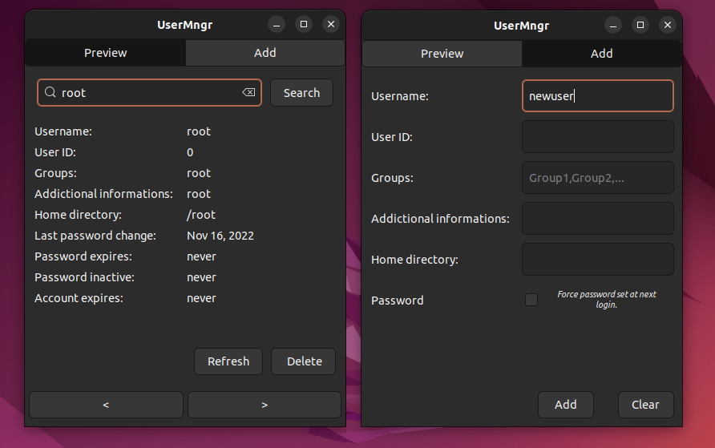

# LinuxUserMngr
Light GUI app to manage users in linux systems. 

 

## Features:
- Synchronization with system data.
- Displaying information about users, user's groups, account expiration.
- Deleting users.
- Adding new users.
- Creating new groups (if not existing while adding a new user).
- Error handling while adding and deleting users and groups.
- Refreshing data from system.
- Keyboard macros.

 

## Keyboard macros

### Preview page:
| Macro | Description |
| ----------- | ----------- |
| `Left Arrow` | Previous user |
| `Right Arrow` | Next user |
| `Delete` | Delete user |
| `F5` | Refresh data |

### Add page:
| Macro | Description |
|  ----------- | ----------- |
| `Enter` | Add user |
| `Delete` | Clear inputs |

